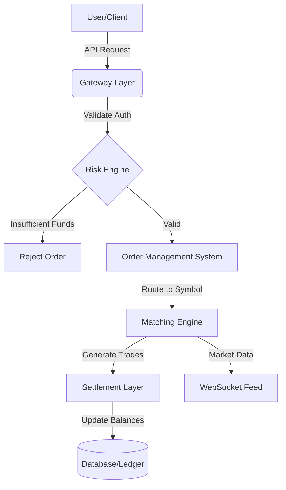
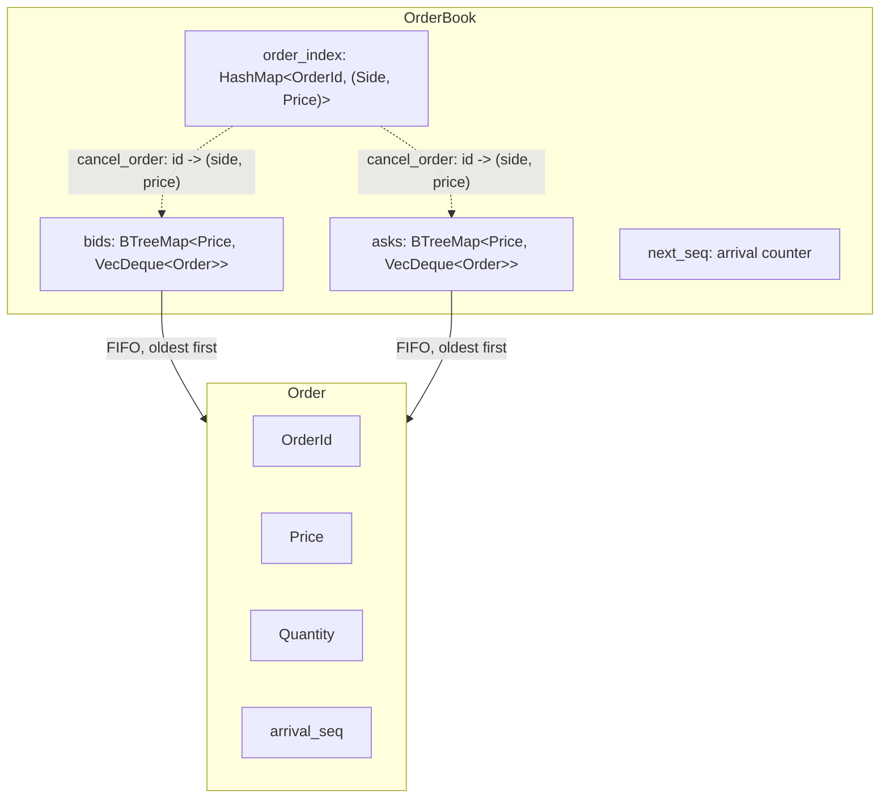
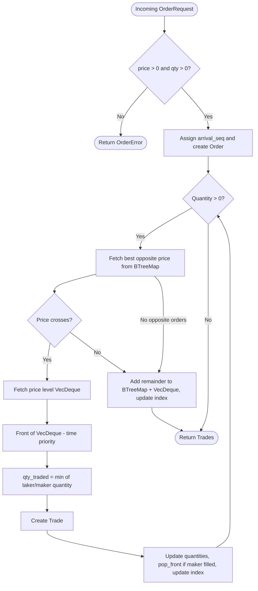

# ferrum-match

A small matching engine for a crypto exchange. You place buy and sell orders; when prices cross, they trade. Anything left over stays on the order book.

## Stack

- **Language:** Rust (2021 edition)
- **CLI:** [clap](https://crates.io/crates/clap) for commands, [rustyline](https://crates.io/crates/rustyline) for the interactive prompt
- **Logging:** [tracing](https://crates.io/crates/tracing)
- **Tests:** `cargo test`, plus [proptest](https://crates.io/crates/proptest) for property-based tests
- **CI:** GitHub Actions

## Current status

What exists today:

- A single-threaded, in-memory limit order book (`src/orderbook`) — no persistence, no event
  log, no network layer yet.
- Price-time priority matching: best price first, FIFO within a price level.
- Partial fills: an order can match against several resting orders across one or more calls,
  and any unfilled remainder rests on the book.
- Cancel by order id.
- Zero-price and zero-quantity rejection at the matching entry point.
- A CLI with an interactive REPL (`cargo run -- interactive`) backed by one in-memory order book.
- Property-based tests (`tests/orderbook.rs`, `tests/invariants.rs`) covering invariants such as
  quantity conservation across a match, no crossed book after matching, no empty price levels
  left behind, and strictly increasing arrival sequence numbers under randomly interleaved
  submit/cancel operations.

What doesn't exist yet (see the "Target architecture" diagram below for where this is heading):

- Concurrency, a network/gateway layer, or multiple order books running at once.
- An event log / WAL — state lives only in process memory and is lost on exit.
- Market orders, or any order type beyond a plain limit order.
- Account balances, margin checks, or authentication.
- Benchmarks (tracked in [#22](https://github.com/hann3pan/ferrum-match/issues/22)).

### Roadmap

- Concurrency and a gateway layer in front of the matching engine.
- Benchmarks (criterion).
- Market orders.

## How to use

Install [Rust](https://rustup.rs/), then from this repo:

```bash
cargo run -- --help
```

### Interactive mode

Best way to try it. One order book stays in memory while you type commands:

```bash
cargo run -- interactive
```

| Command | What it does |
| --- | --- |
| `buy 100 5` | Buy 5 at price 100 |
| `sell 100 3` | Sell 3 at price 100 |
| `print` | Show the book |
| `delete 1` | Cancel order id 1 |
| `exit` | Quit |

Price and quantity are whole numbers. If a buy and a sell overlap, they match. Leftover size stays on the book.

Bad input (an invalid id, a non-numeric price, a price/quantity of zero, ...) prints an error and
keeps the prompt running instead of crashing.

### Headless mode

`cargo run -- run` is not implemented yet; it prints a message and exits with a non-zero status.

### Tests

```bash
cargo test
```

## Target architecture (not yet implemented)

The diagram below is where this project is heading, not what exists in the code today — see
"Current status" above for what's actually implemented. Only the matching engine (`F`) exists
right now, as the in-memory `OrderBook` described below.



## Engine structure (current)



`order_index` only tracks orders that are currently resting on the book; it's removed as soon as
an order is fully filled or cancelled (see "Design decisions" below).

## Matching mechanism



## Design decisions

- **`BTreeMap<Price, VecDeque<Order>>` for price levels.** Price-time priority needs the best
  (highest bid / lowest ask) price on every match, and new resting orders arrive at arbitrary
  prices. A `BTreeMap` keeps price levels sorted by key, so the best price is always at one end
  of the key order and an order's price level is a single key lookup.
- **`VecDeque<Order>` per price level.** Within a price level, time priority means strict FIFO:
  the order that arrived first fills first. `VecDeque` gives O(1) `push_back` to add a new
  resting order at the back of the queue and O(1) `pop_front`/`front_mut` to find and fill the
  oldest order, without shifting the whole level on every match.
- **`order_index: HashMap<OrderId, (Side, Price)>`.** Cancelling an order by id would otherwise
  require scanning every price level on both sides to find it. The index maps an order id
  directly to the `(side, price)` it rests at, so cancel only has to look at one price level.

### Time complexity (n = number of distinct price levels on a side, k = number of orders resting at one price level)

| Operation | Complexity | Why |
| --- | --- | --- |
| `best_bid` / `best_ask` | O(log n) | `BTreeMap::keys().next_back()` / `.next()` descend the tree to the first/last key. |
| Add a non-crossing order to the book | O(log n) | `BTreeMap` entry lookup/insert for the price level, then O(1) amortized `push_back`. |
| Match one taker against m makers | O(m log n) | Each fill re-reads the best opposite price (O(log n)); per-fill work beyond that is O(1). |
| `cancel_order` | O(log n) + O(k) | O(1) average index lookup gives the `(side, price)`, O(log n) `BTreeMap` lookup for the level, then an O(k) linear scan of that level's `VecDeque` to find and remove the specific order (`VecDeque::remove` shifts elements). |

This is honest about `cancel_order` *not* being O(1): the index only narrows the search to a
single price level, it doesn't locate the order within that level's queue.
